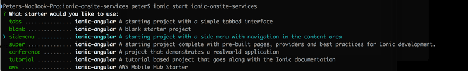

# Build Notes

This directory contains a description of the steps taken to build the application. Ideally they should be able to be used to reproduce the entire application without any source code although I expect that this goal is not realistic. 

## Initial ionic app skeleton



## Login Page before menu
Starting with the CLI generate sidemenu template we need to isolate the a login page as per [Rob Loui's Article](http://roblouie.com/article/344/ionic-2-hide-menu-or-tabs-for-login-screen/)

````bash
cd ./ionic-onsite-services/src/app
ionic cordova platform add ios
cp app.component.ts menu.component.ts
cp app.html menu.html
## modify menu.components - remove initializeapp and rename class to MenuCompinent
## add menu component to app.module.ts

rm app.html ## no longer needed as inlined

cd ../..
ionic serve
````

"If you run the app now, you should notice that it looks exactly the same as the starter sidemenu app, the sidemenu component, because the MenuComponent is added to the nav stack. "

### Firebase Login module

Configure as per https://github.com/angular/angularfire2

````
npm install angularfire2 firebase --save
npm install @ionic/app-scripts@latest --save-dev ## not sure if needed but seems to help with debugging etc .. wraps some build script capabilities?
npm install promise-polyfill ## iOS build breaks without this
````

*TODO* - describe the firebase setup and configuration of users etc.


#### Accomodating Network interruptions
as per [Angular Offline Extension](https://javebratt.com/offline-angularfire2/)
````
 npm install angularfire2-offline --save
````
then replace references imports in modules 

````typescript
import { 
  AfoListObservable, 
  AngularFireOfflineDatabase } from 'angularfire2-offline/database';
````
and
````
public items: AfoListObservable<any[]>;
constructor(afoDatabase: AngularFireOfflineDatabase, 
    public alertCtrl: AlertController) {
    this.items = afoDatabase.list('/items');
}
````

### Expanding to provide Facebook Login
as per https://ionicframework.com/docs/native/facebook/

````
 ionic cordova plugin add cordova-plugin-facebook4 --variable APP_ID="123456789" --variable APP_NAME="myApplication"
 npm install --save @ionic-native/facebook

 npm install --save @ionic-native/facebook

## maybe also need inapp browser ?? --- ionic cordova plugin add cordova-plugin-inappbrowser --save

````


# iOS Build

````ionic build ios````

# Design

## Icons and splash

See ````ionic cordova resources --help```` for icons and splash screen reouce creation
    The source image for icons should ideally be at least 1024×1024px and located at resources/icon.png. The source
    image for splash screens should ideally be at least 2732×2732px and located at resources/splash.png.


# References

[Angular Style Guide](https://angular.io/guide/styleguide)


